## Phase 1 Demo — SiWx917 Dual-Stack Thermostat (Matter + MQTT + HTTPS)

### Description

Build a SiWx917 BRD4338A Wi-Fi Thermostat app to evaluate:

- **Matter thermostat** — BLE commission, control over Wi-Fi
- **Dual stack** — Matter + MQTTS on host LwIP; HTTPS on NWP
- **Live MQTT** — stay connected; publish and receive
- **HTTPS** — GET / PUT / POST of a small file

This demo uses TLS 1.2 for authentication and FreeRTOS Heap4 for memory management.

**Project name:** `matter_wifi_soc_thermostat_dual_stack_freertos`

## Adding Wi-Fi and Matter Extension in Studio

1. Open Simplicity Studio V6 and install SISDK 2026.6 (do not install Matter and Wi-Fi SDK yet).

2. Once installed, open **SDKs** in settings and select **Add Extension**.

   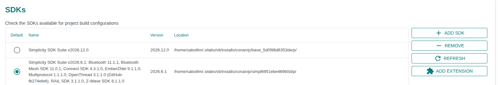

3. Add the Matter and Wi-Fi extensions:

   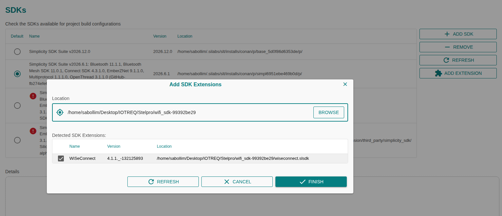

   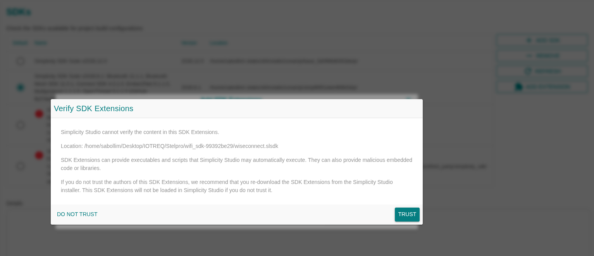

   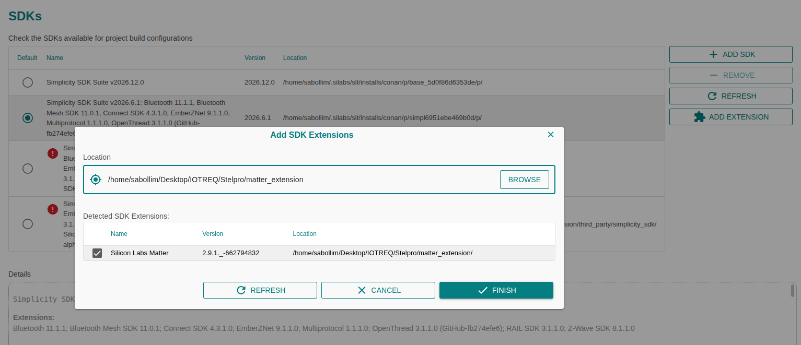

4. Once both extensions are added, the SDK should look like this:

   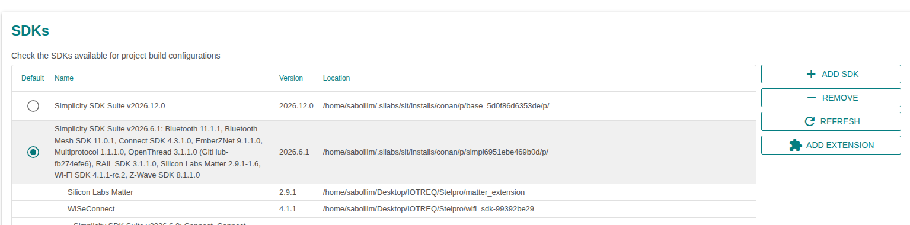

5. Customize the demo in the Matter source. Open the Matter source as shown below:

   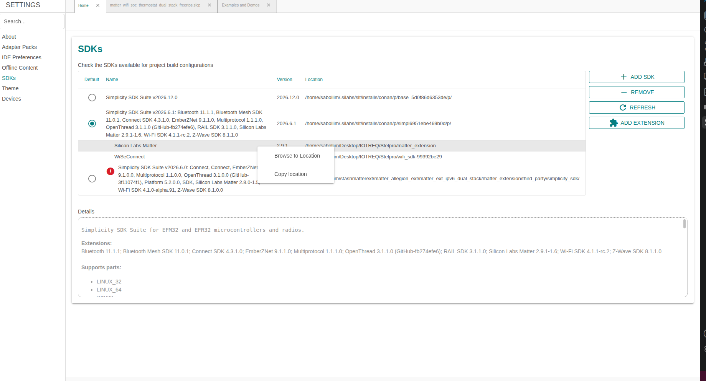

6. Apply the changes below in:
   - `third_party/matter_sdk/examples/thermostat/silabs/include/mqtt_example.h`
   - `third_party/matter_sdk/examples/thermostat/silabs/include/https_offload_example.h`
   - `third_party/matter_sdk/examples/thermostat/silabs/certs/cacert.h`

### MQTTS changes (`mqtt_example.h`)

Add these `#define`s near the top of the file (before the `#ifndef` / `#error` checks). Values must match your LAN broker:

| Symbol              | Description                                                                                                           |
| ------------------- | --------------------------------------------------------------------------------------------------------------------- |
| `MQTT_BROKER_IP`    | Device connects to this IPv4 address for MQTTS. Must be reachable from the board.                                     |
| `MQTT_TLS_HOSTNAME` | Hostname used for TLS certificate check (CN/SAN). Not used as the IP. Must match the broker certificate or TLS fails. |
| `MQTT_BROKER_PORT`  | MQTTS TCP port.                                                                                                       |

Optional overrides (defaults exist via `#ifndef`): `MQTT_USERNAME`, `MQTT_PASSWORD`, `MQTT_TOPIC`.

Example (replace with your broker values):

```c
#define MQTT_BROKER_IP ""
#define MQTT_TLS_HOSTNAME ""
#define MQTT_BROKER_PORT 8883
```

### Certificates (`certs/cacert.h`)

- `kCaCertExample[]` — Trusted CA used to verify the broker TLS cert. Fill with PEM of the CA that signed the broker cert (same format as the sample: `-----BEGIN CERTIFICATE-----` …). The sample CA will not work with your broker.
- `kCaCertExample[]` — Trusted CA used to verify the HTTPS server cert. Same file as MQTTS. Fill with PEM of the CA that signed the HTTPS server cert.
- If MQTTS and HTTPS use different CAs, use the CA for the demo you are running (or split into two cert files).

### HTTPS changes (`https_offload_example.h`)

Add these `#define`s near the top of the file (before the `#ifndef` / `#error` checks). Values must match your LAN HTTPS server:

| Symbol           | Description                                                                                             |
| ---------------- | ------------------------------------------------------------------------------------------------------- |
| `HTTP_SERVER_IP` | Device connects to this IPv4 address for HTTPS. Must be reachable from the board.                       |
| `HTTP_HOSTNAME`  | Hostname used for TLS certificate check (CN/SAN / SNI). Must match the server certificate or TLS fails. |
| `HTTP_PORT`      | HTTPS TCP port.                                                                                         |

Optional overrides (defaults exist via `#ifndef`): `HTTP_USER`, `HTTP_PASS`.

Example (replace with your server values):

```c
#define HTTP_SERVER_IP ""
#define HTTP_HOSTNAME ""
#define HTTP_PORT 8443
```

## Creating Thermostat Demo in Studio

1. Go to **Home**, select **Matter** projects.

   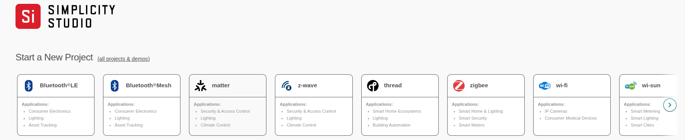

2. Filter projects with the **Dual** keyword and select the thermostat project.

   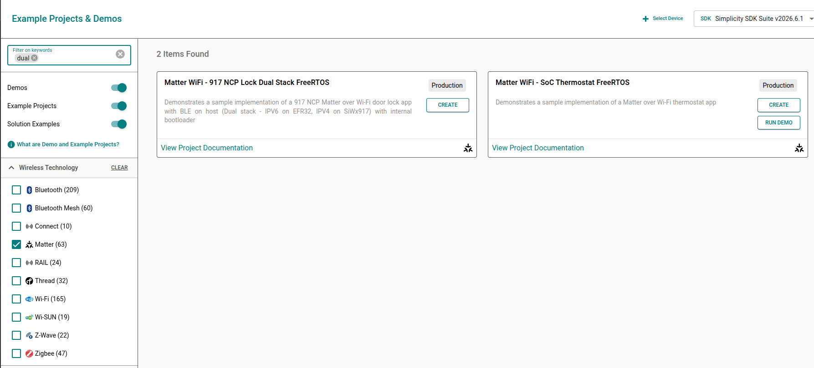

3. Select target device **BRD4338A**.

   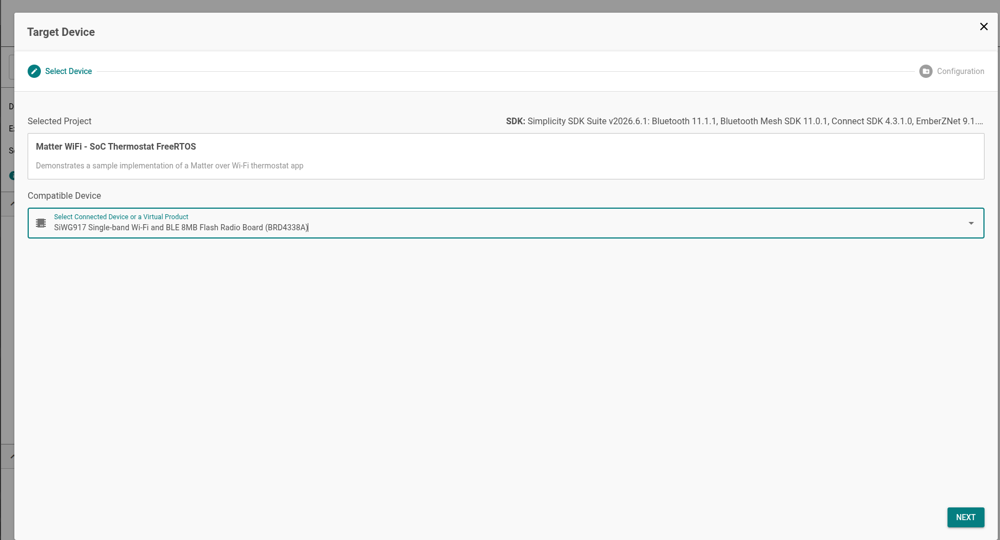

4. Configure the project as below.

   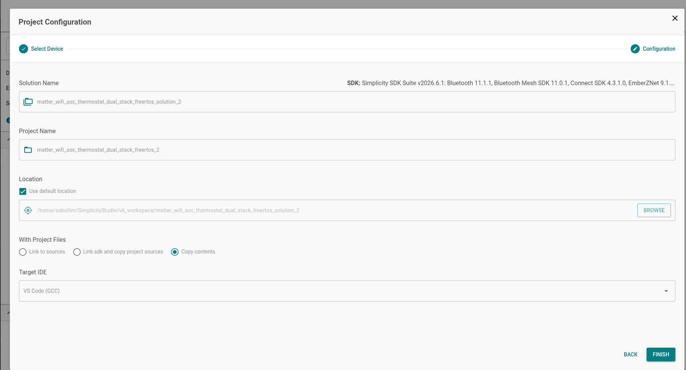

5. Once **Finish** is selected, the project is created.

   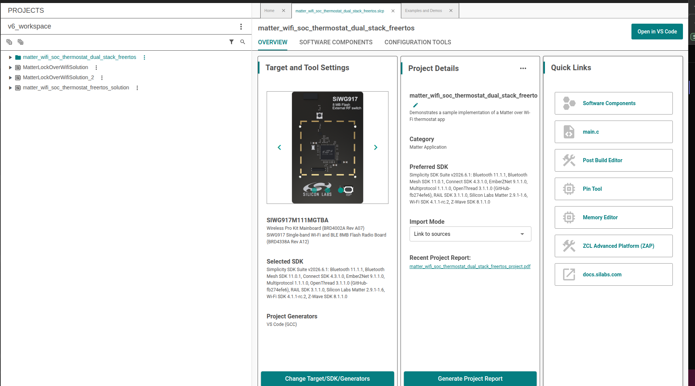

6. Sometimes generation fails during project creation. Force generate if generation fails.

   

7. Once generation is successful, select **Open in VS Code**.

8. The project opens in VS Code. Select the build icon beside the project name to build.

   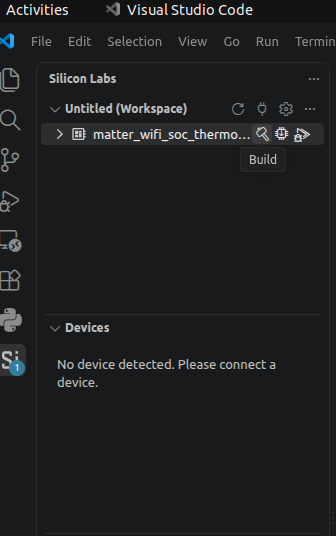

9. Build should complete successfully. You will see logs like below in the VS Code terminal.

   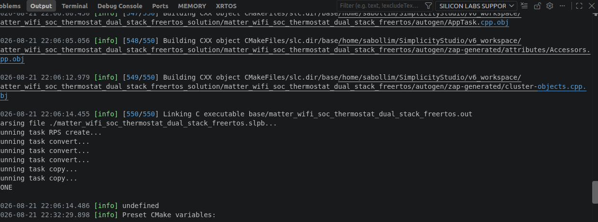

10. If the device is attached to the workstation, select the flash icon beside the project name in Studio, or use Commander to flash the image.

    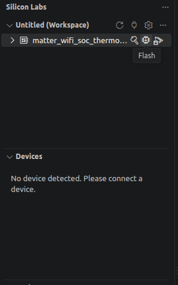

## What the Customer Needs to Change for Validating the Demo

Edit before build. Point defaults at **your** LAN.

### MQTT — `mqtt_example.h`

| Field        | `#define`                         | Demo default      | Customer need to set     |
| ------------ | --------------------------------- | ----------------- | ------------------------ |
| Broker IP    | `MQTT_BROKER_IP`                  | ``                | MQTTS broker IPv4        |
| TLS hostname | `MQTT_TLS_HOSTNAME`               | ``                | Matches broker cert      |
| Port         | `MQTT_BROKER_PORT`                | ``                | MQTTS port               |
| User / pass  | `MQTT_USERNAME` / `MQTT_PASSWORD` | `john` / `doe`    | Broker auth              |
| Topic        | `MQTT_TOPIC`                      | `THERMOSTAT-DATA` | Align with MQTT Explorer |
| CA           | `kCaCertExample[]` in `cacert.h`  | Broker CA         |

### HTTPS — `https_offload_example.h`

| Field     | `#define`                        | Demo default   | Customer need to set |
| --------- | -------------------------------- | -------------- | -------------------- |
| Server IP | `HTTP_SERVER_IP`                 | ``             | HTTPS server IPv4    |
| Hostname  | `HTTP_HOSTNAME`                  | ``             | Matches server cert  |
| Port      | `HTTP_PORT`                      | ``             | HTTPS port           |
| Auth      | `HTTP_USER` / `HTTP_PASS`        | `john` / `doe` | Auth                 |
| CA        | `kCaCertExample[]` in `cacert.h` | Server CA      |

## Software and Hardware Requirements

- SiWx917 kit
- Wi-Fi AP
- Mosquitto
- Local HTTPS server
- `chip-tool` or other commissioning tool

Steps to install Mosquitto and set up a local HTTPS server on a Linux machine.

> **Note:** Broker and HTTPS server must be on the **same LAN** as the board.

## How to Test

### Matter commissioning and basic thermostat commands

After flashing the image on the BRD4338A board, run the following from chip-tool:

```bash
# Commission device using chip-tool
chip-tool pairing ble-wifi 1 <SSID> <PSK> 20202021 3840
# Expect successful commissioning in chip-tool log

# Write to device using chip-tool
chip-tool thermostat write occupied-cooling-setpoint 2500 1 1
# Expect success in chip-tool log

# Read from device using chip-tool
chip-tool thermostat read occupied-cooling-setpoint 1 1
# Expect "2500" value as output in chip-tool log
```

### MQTT

After Wi-Fi is up, wait for the device log: `MQTT live demo ready` (~10 s after connectivity).

1. Subscribe to `THERMOSTAT-DATA` **before** device boot:

   ```bash
   mosquitto_sub -h <IP> -p 8883 --cafile ca.crt -t THERMOSTAT-DATA -v
   ```

2. After the device boots, you should see a publish message:
   `THERMOSTAT-DATA THIS IS MQTT CLIENT DEMO FROM APPLICATION`

3. Publish from Explorer to `THERMOSTAT-DATA` and check whether the device receives the published message (not working in the current demo; the demo is closing).

**MQTT demo logs on device:**

```text
[0000:00:17.814][info][DL] MQTT client initialized
[0000:00:17.814][info][DL] MQTT demo starting
[0000:00:17.815][info][DL] MQTT connecting to broker 192.168.0.191 port 8883 (TLS=yes)
[0000:00:18.159][info][DL] MQTT TCP/TLS connection established
[0000:00:18.170][info][DL] MQTT connected
[0000:00:18.184][info][DL] MQTT subscribed to THERMOSTAT-DATA
[0000:00:18.202][info][DL] MQTT message on THERMOSTAT-DATA: THIS IS MQTT CLIENT DEMO FROM APPLICATION
[0000:00:18.230][info][DL] MQTT published to THERMOSTAT-DATA
[0000:00:18.231][info][DL] MQTT waiting for message on topic THERMOSTAT-DATA
```

### HTTPS

After Wi-Fi is up and MQTT is connected, HTTPS connects and performs PUT, GET, and POST. Validate with the logs below:

```text
[0000:00:18.252][info][DL] HTTPS loaded TLS CA at index 1
[0000:00:18.253][info][DL] HTTPS client init success
[0000:00:18.253][info][DL] HTTPS starting on offload stack
[0000:00:19.761][info][DL] HTTPS PUT response: status=0x0 end_of_data=0 data_len=0
[0000:00:19.765][info][DL] HTTPS PUT response: status=0x0 end_of_data=0 data_len=0
[0000:00:19.804][info][DL] HTTPS PUT response: status=0x0 end_of_data=1 data_len=0
[0000:00:19.987][info][DL] HTTPS PUT response: status=0x0 end_of_data=9 data_len=59
[0000:00:19.988][info][DL] HTTPS PUT request success
[0000:00:21.442][info][DL] HTTPS GET response: status=0x0 http_code=200 data_len=1024
[0000:00:22.372][info][DL] HTTPS GET response: status=0x0 http_code=0 data_len=201
[0000:00:22.373][info][DL] HTTPS GET request success
[0000:00:25.073][info][DL] HTTPS POST response: status=0x0 http_code=200 data_len=38
[0000:00:25.073][info][DL] HTTPS POST request success
[0000:00:25.074][info][DL] HTTPS demo completed
```

### Pass criteria

Same flash image:

- Matter commission and thermostat R/W work
- MQTT connects and can publish and receive messages
- HTTPS PUT / GET / POST succeed

Evaluation demo only.
