## Phase 2 Demo — SiWx917 Dual-Stack Thermostat (Matter + MQTT + HTTPS)

### Description

Build a SiWx917 BRD4338A Wi-Fi Thermostat app to evaluate:

- **Matter thermostat** — BLE commission, control over Wi-Fi
- **Dual stack** — Matter + MQTTS on host LwIP; HTTPS on NWP
- **Live MQTT** — stay connected (idle auto-yield); subscribe/publish via Matter shell; receive inbound publishes
- **HTTPS** — GET / PUT / POST via Matter shell after client init

This demo uses TLS 1.2 for authentication and FreeRTOS Heap4 for memory management.

**Project name:** `matter_wifi_soc_thermostat_dual_stack_freertos`

### Runtime flow (AppTask + Matter shell)

Service demos are owned by the thermostat `AppTask` (not `BaseApplication`):

1. On `kInternetConnectivityChange` (IPv4, or IPv6 when dual-stack is enabled), `AppTask::MatterServicesEventHandler` posts work to the AppTask thread.
2. `mqtt_client_demo_start()` — Start / Init / Connect. The MQTT service thread idle-yields for keepalive and inbound messages; the session stays up.
3. `https_client_demo_start()` — Start / Init only (default NWP certificate index; no hardcoded index).
4. On `kWiFiConnectivityChange` with `kConnectivity_Lost`, `mqtt_client_demo_stop()` disconnects MQTT (Start/Init kept for reconnect).
5. Matter shell (`demo mqtt` / `demo http`) posts subscribe/publish or HTTPS PUT/GET/POST onto the AppTask thread so blocking work does not starve the CHIP stack.

## Adding Wi-Fi and Matter Extension in Studio

1. Open Simplicity Studio V6 and install SISDK 2026.6 (do not install Matter and Wi-Fi SDK yet).
2. Once installed, open **SDKs** in settings and select **Add Extension**.
  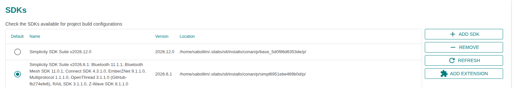
3. Add the Matter and Wi-Fi extensions:
  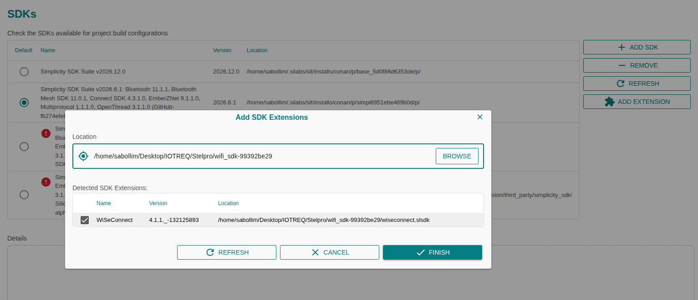
   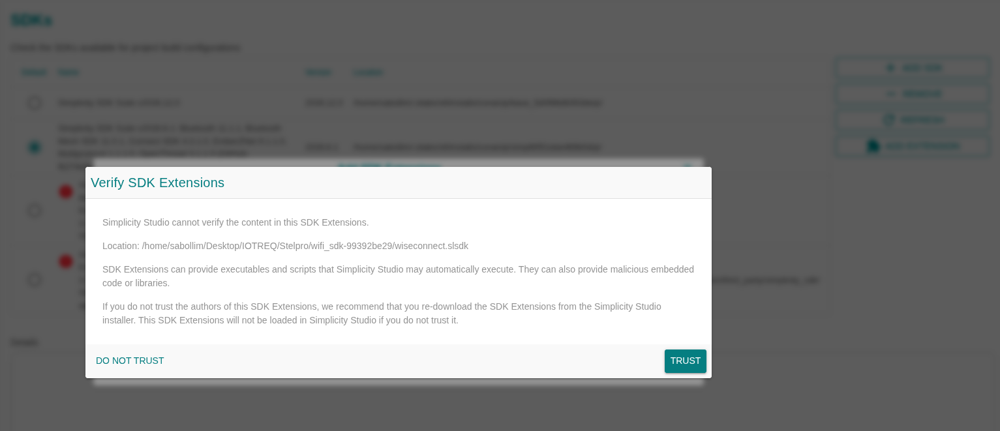
   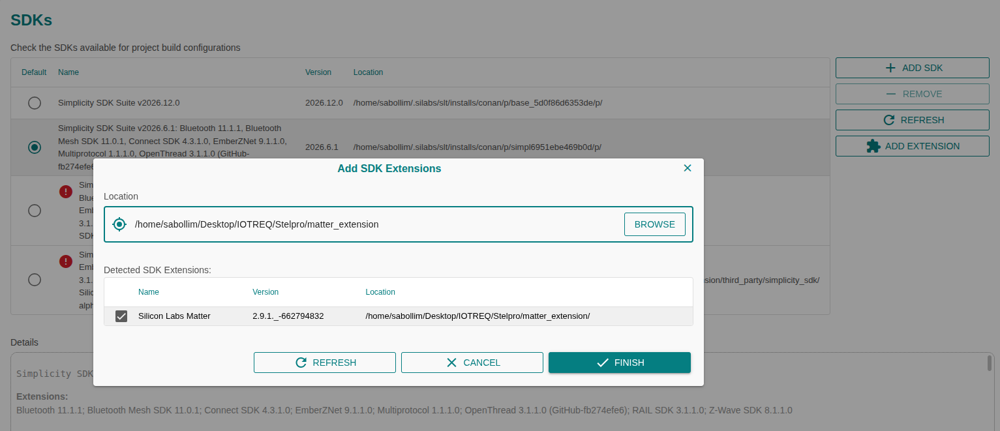
4. Once both extensions are added, the SDK should look like this:
  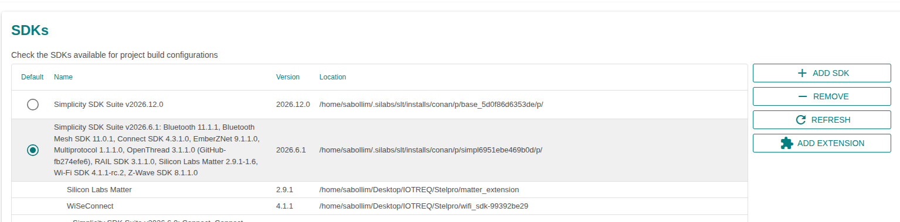
5. Customize the demo in the Matter source. Open the Matter source as shown below:
  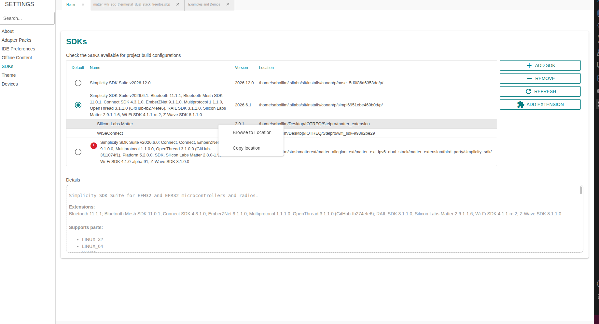
6. Apply the changes below in:
  - `third_party/matter_sdk/examples/thermostat/silabs/src/mqtt_example.cpp`
  - `third_party/matter_sdk/examples/thermostat/silabs/include/mqtt_example.h`
  - `third_party/matter_sdk/examples/thermostat/silabs/include/https_offload_example.h`
  - `third_party/matter_sdk/examples/thermostat/silabs/certs/cacert.h`

### Changes for `OnPlatform` events based on the `CHIPDeviceEvent.h`

Event types come from `third_party/matter_sdk/src/include/platform/CHIPDeviceEvent.h` (`DeviceEventType`). The MQTT demo registers `OnPlatformEvent` with `PlatformMgr().AddEventHandler` in `mqtt_example.cpp` (from `mqtt_client_demo_start`, once when the client is not yet initialized).


| Event (`DeviceEventType`)            | Condition / payload                   | Demo log                            |
| ------------------------------------ | ------------------------------------- | ----------------------------------- |
| `kWiFiConnectivityChange`            | `Result == kConnectivity_Established` | `MQTT demo: WiFi Connected`         |
| `kWiFiConnectivityChange`            | `Result == kConnectivity_Lost`        | `MQTT demo: WiFi Disconnected`      |
| `kCommissioningComplete`             | Commissioning finished                | `MQTT demo: Commissioning Complete` |
| `kSLSystemEventCommissioningStarted` | Commissioning started                 | `MQTT demo: Commissioning Started`  |
| `kSLSystemEventCommissioningFailed`  | Commissioning failed                  | `MQTT demo: Commissioning Failed`   |


Example handler (already in the demo source):

```cpp
void OnPlatformEvent(const ChipDeviceEvent * event, intptr_t /* arg */)
{
    VerifyOrReturn(event != nullptr);

    switch (event->Type)
    {
    case DeviceEventType::kWiFiConnectivityChange:
        if (event->WiFiConnectivityChange.Result == kConnectivity_Established)
        {
            ChipLogProgress(DeviceLayer, "MQTT demo: WiFi Connected");
        }
        else if (event->WiFiConnectivityChange.Result == kConnectivity_Lost)
        {
            ChipLogProgress(DeviceLayer, "MQTT demo: WiFi Disconnected");
        }
        break;

    case DeviceEventType::kCommissioningComplete:
        ChipLogProgress(DeviceLayer, "MQTT demo: Commissioning Complete");
        break;

    case DeviceEventType::kSLSystemEventCommissioningStarted:
        ChipLogProgress(DeviceLayer, "MQTT demo: Commissioning Started");
        break;

    case DeviceEventType::kSLSystemEventCommissioningFailed:
        ChipLogProgress(DeviceLayer, "MQTT demo: Commissioning Failed");
        break;

    default:
        break;
    }
}
```

Registration:

```cpp
err = PlatformMgr().AddEventHandler(OnPlatformEvent, 0);
```

These prints are for observing connectivity and commissioning while MQTT/HTTPS run. Starting and stopping the services on IP/Wi-Fi changes is handled separately by `MatterServicesEventHandler` in `AppTask.cpp` (`kInternetConnectivityChange` / `kWiFiConnectivityChange`).

### MQTTS changes (`mqtt_example.h`)

Add these `#define`s near the top of the file (before the `#ifndef` / `#error` checks). Values must match your LAN broker:


| Symbol              | Description                                                                                                           |
| ------------------- | --------------------------------------------------------------------------------------------------------------------- |
| `MQTT_BROKER_IP`    | Device connects to this IPv4 address for MQTTS. Must be reachable from the board.                                     |
| `MQTT_TLS_HOSTNAME` | Hostname used for TLS certificate check (CN/SAN). Not used as the IP. Must match the broker certificate or TLS fails. |
| `MQTT_BROKER_PORT`  | MQTTS TCP port.                                                                                                       |


Optional overrides (defaults exist via `#ifndef`): `MQTT_USERNAME`, `MQTT_PASSWORD`, `MQTT_TOPIC`, `MQTT_PUBLISH_MESSAGE`.

Example (replace with your broker values):

```c
#define MQTT_BROKER_IP ""
#define MQTT_TLS_HOSTNAME ""
#define MQTT_BROKER_PORT 8883
#define MQTT_TOPIC "MQTT_TOPIC"
#define MQTT_PUBLISH_MESSAGE "MQTT_PUBLISH_MESSAGE"
```

Inbound publishes are delivered through `MqttClient::SetSubscriptionCallback` (`OnMqttMessage` in `mqtt_example.cpp`). While connected and idle, the MQTT service thread auto-runs `MQTTYield` for keepalive and receive — no explicit Yield from the demo is required after subscribe/publish.

### Certificates (`certs/cacert.h`)

- `kCaCertExample[]` — Trusted CA used to verify the broker TLS cert. Fill with PEM of the CA that signed the broker cert (same format as the sample: `-----BEGIN CERTIFICATE-----` …). The sample CA will not work with your broker.
- `kCaCertExample[]` — Trusted CA used to verify the HTTPS server cert. Same file as MQTTS. Fill with PEM of the CA that signed the HTTPS server cert.
- If MQTTS and HTTPS use different CAs, use the CA for the demo you are running (or split into two cert files).

### HTTPS changes (`https_offload_example.h`)

Add these `#define`s near the top of the file (before the `#ifndef` / `#error` checks). Values must match your LAN HTTPS server:


| Symbol           | Description                                                                                             |
| ---------------- | ------------------------------------------------------------------------------------------------------- |
| `HTTP_SERVER_IP` | Device connects to this IPv4 address for HTTPS. Must be reachable from the board.                       |
| `HTTP_HOSTNAME`  | Hostname used for TLS certificate check (CN/SAN / SNI). Must match the server certificate or TLS fails. |
| `HTTP_PORT`      | HTTPS TCP port.                                                                                         |


Optional overrides (defaults exist via `#ifndef`): `HTTP_USER`, `HTTP_PASS`.

Example (replace with your server values):

```c
#define HTTP_SERVER_IP ""
#define HTTP_HOSTNAME ""
#define HTTP_PORT 8443
```

The HTTPS demo leaves `HttpClientConfig::certificateIndex` at the default (`SL_HTTPS_CLIENT_DEFAULT_CERTIFICATE_INDEX`, typically `0`). Do not hardcode a non-default index unless your NWP credential layout requires it.

## Creating Thermostat Demo in Studio

1. Go to **Home**, select **Matter** projects.
  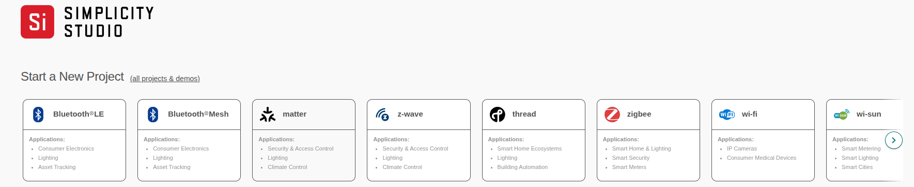
2. Filter projects with the **Dual** keyword and select the thermostat project.
  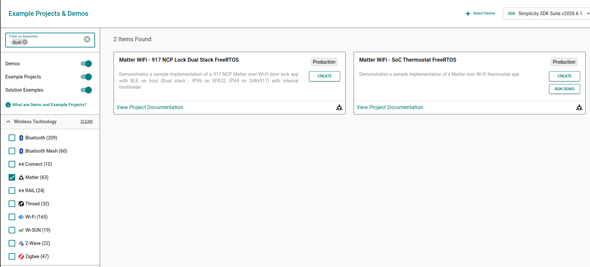
3. Select target device **BRD4338A**.
  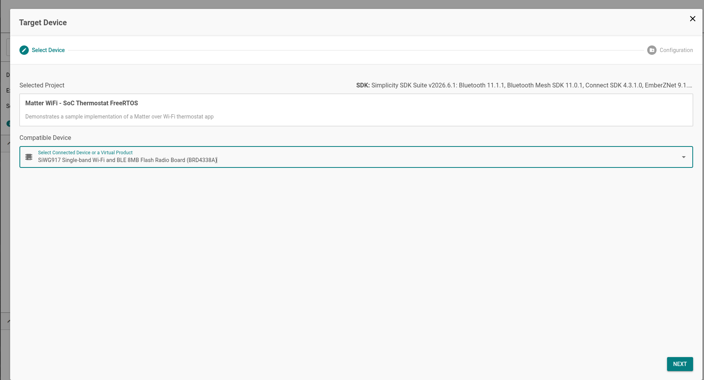
4. Configure the project as below.
  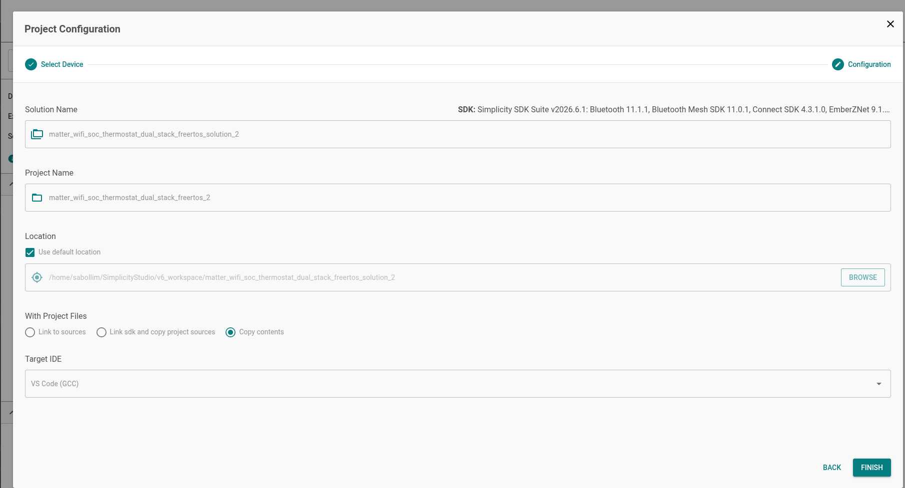
5. Once **Finish** is selected, the project is created.
  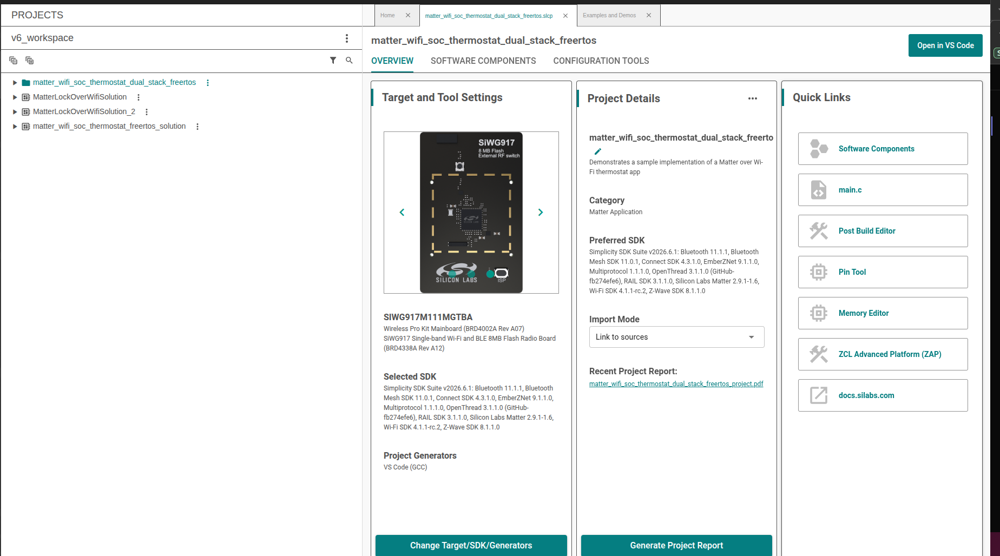
6. Sometimes generation fails during project creation. Force generate if generation fails.
  
7. Once generation is successful, select **Open in VS Code**.
8. The project opens in VS Code. Select the build icon beside the project name to build.
  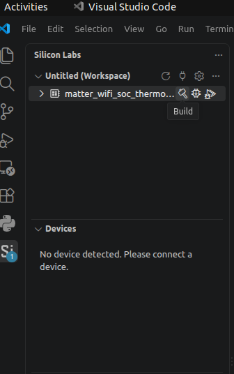
9. Build should complete successfully. You will see logs like below in the VS Code terminal.
  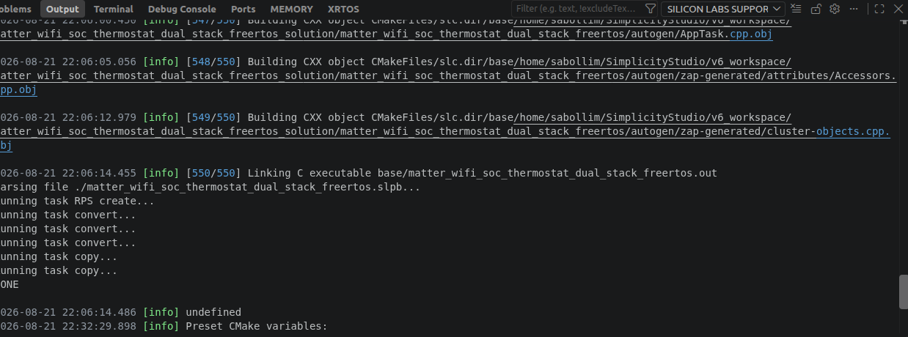
10. If the device is attached to the workstation, select the flash icon beside the project name in Studio, or use Commander to flash the image.
  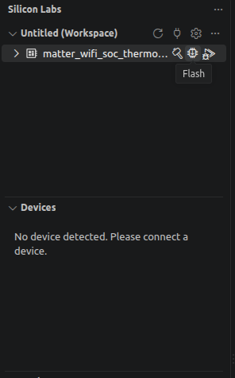

## Changes needed for validating the demo

Edit before build. Point defaults at **your** LAN.

### MQTT — `mqtt_example.h`


| Field        | `#define`                         | Demo default           | Customer need to set     |
| ------------ | --------------------------------- | ---------------------- | ------------------------ |
| Broker IP    | `MQTT_BROKER_IP`                  | ``                     | MQTTS broker IPv4        |
| TLS hostname | `MQTT_TLS_HOSTNAME`               | ``                     | Matches broker cert      |
| Port         | `MQTT_BROKER_PORT`                | ``                     | MQTTS port               |
| User / pass  | `MQTT_USERNAME` / `MQTT_PASSWORD` | `john` / `doe`         | Broker auth              |
| Topic        | `MQTT_TOPIC`                      | `MQTT_TOPIC`           | Align with MQTT Explorer |
| Publish body | `MQTT_PUBLISH_MESSAGE`            | `MQTT_PUBLISH_MESSAGE` | Payload you expect       |
| CA           | `kCaCertExample[]` in `cacert.h`  | Broker CA              |                          |


### HTTPS — `https_offload_example.h`


| Field     | `#define`                        | Demo default   | Customer need to set |
| --------- | -------------------------------- | -------------- | -------------------- |
| Server IP | `HTTP_SERVER_IP`                 | ``             | HTTPS server IPv4    |
| Hostname  | `HTTP_HOSTNAME`                  | ``             | Matches server cert  |
| Port      | `HTTP_PORT`                      | ``             | HTTPS port           |
| Auth      | `HTTP_USER` / `HTTP_PASS`        | `john` / `doe` | Auth                 |
| CA        | `kCaCertExample[]` in `cacert.h` | Server CA      |                      |


## Software and Hardware Requirements

- SiWx917 kit
- Wi-Fi AP
- Mosquitto
- Local HTTPS server
- `chip-tool` or other commissioning tool
- Serial terminal attached to the device console (Matter shell)

Steps to install Mosquitto and set up a local HTTPS server on a Linux machine.

> **Note:** Broker and HTTPS server must be on the **same LAN** as the board.

## How to Test

### Matter commissioning and basic thermostat commands

After flashing the image on the BRD4338A board, run the following from `chip-tool`:

```bash
# Commission device using chip-tool
chip-tool pairing ble-wifi 1 <SSID> <PSK> 20202021 3840
# Expect successful commissioning in chip-tool log

# Write to device using chip-tool
chip-tool thermostat write occupied-cooling-setpoint 2500 1 1
# Expect success in chip-tool log

# Read from device using chip-tool
chip-tool thermostat read occupied-cooling-setpoint 1 1
# Expect "2500" value as output in chip-tool log
```

### Matter shell (required for MQTT / HTTPS demos)

Open a serial terminal to the device console (Matter shell is enabled for this dual-stack thermostat build). After Wi-Fi / internet is up, wait for service start logs, then run demos from the shell.

Help:

```text
demo
```

Expected help text (when both services are enabled):

```text
Usage: demo <service>
  http  Run HTTPS PUT/GET/POST on the AppTask thread
  mqtt  Run MQTT connect/subscribe/publish on the AppTask thread
```


| Shell command | What runs on AppTask                                       |
| ------------- | ---------------------------------------------------------- |
| `demo mqtt`   | `mqtt_client_demo_run()` — Subscribe + Publish             |
| `demo http`   | `https_client_demo_run()` — HTTPS PUT, then GET, then POST |


Shell replies immediately with a post confirmation; results appear in the device log:

```text
> demo mqtt
Posting MQTT connect/subscribe/publish to AppTask

> demo http
Posting HTTPS PUT/GET/POST to AppTask
```

Do not run these from the shell thread expectation of blocking completion — the shell only queues AppTask work.

### MQTT

After Wi-Fi is up, wait for connectivity-driven start. Expect logs similar to:

```text
Scheduling Matter Services initialization
MQTT client initialized
MQTT demo starting
MQTT connecting to broker <broker-ip> port 8883 (TLS=yes)
MQTT TCP/TLS connection established
MQTT connected
MQTT ready (use demo mqtt for subscribe/publish)
```

1. Subscribe on the host to your topic (example uses `MQTT_TOPIC`) **before** running `demo mqtt`:
  ```bash
   mosquitto_sub -h <IP> -p 8883 --cafile ca.crt -t MQTT_TOPIC -v
  ```
2. On the device Matter shell:
  ```text
   demo mqtt
  ```
3. On the host subscriber you should see the configured `MQTT_PUBLISH_MESSAGE` on `MQTT_TOPIC`.
4. Publish from MQTT Explorer (or `mosquitto_pub`) to the same topic. The device should log the inbound message via the subscription callback while the session stays alive (idle auto-yield).

**MQTT demo logs on device (after** `demo mqtt`**):**

```text
[info][DL] MQTT subscribed to MQTT_TOPIC
[info][DL] MQTT published to MQTT_TOPIC
[info][DL] MQTT demo completed (auto-yield keeps session alive)
[info][DL] MQTT message received on topic: MQTT_TOPIC
[info][DL] MQTT message: <payload from broker>
[info][DL] MQTT demo message on MQTT_TOPIC: <payload from broker>
```

You can run `demo mqtt` again later; if already connected, Connect is skipped and Subscribe/Publish run again.

### HTTPS

After Wi-Fi is up, `https_client_demo_start()` loads the CA at the default certificate index and inits the client. Then run the request sequence from the Matter shell:

```text
demo http
```

Validate with logs similar to:

```text
[info][DL] HTTPS loaded TLS CA at index 0
[info][DL] HTTPS client init success
[info][DL] HTTPS starting on offload stack
[info][DL] HTTPS PUT response: status=0x0 end_of_data=0 data_len=0
[info][DL] HTTPS PUT response: status=0x0 end_of_data=1 data_len=0
[info][DL] HTTPS PUT response: status=0x0 end_of_data=9 data_len=59
[info][DL] HTTPS PUT request success
[info][DL] HTTPS GET response: status=0x0 http_code=200 data_len=1024 end_of_data=...
[info][DL] HTTPS GET request success
[info][DL] HTTPS POST response: status=0x0 http_code=200 data_len=38
[info][DL] HTTPS POST request success
[info][DL] HTTPS demo completed
```

Init (`HTTPS loaded TLS CA…` / `HTTPS client init success`) happens on connectivity; PUT/GET/POST lines appear after `demo http`.

### Pass criteria

Same flash image:

- Matter commission and thermostat R/W work
- MQTT connects on internet up; `demo mqtt` can publish and the device can receive inbound messages while the session stays alive
- `demo http` HTTPS PUT / GET / POST succeed

Evaluation demo only.

## CHANGELOG

Changes reflected in this guide:


| Commit / area         | Change                                                                                                                                                                                                                                    |
| --------------------- | ----------------------------------------------------------------------------------------------------------------------------------------------------------------------------------------------------------------------------------------- |
| `997c85ff362` (#1165) | Matter service demos moved from `BaseApplication` to thermostat `AppTask`. MQTT idle auto-yield keeps the session alive; subscription callback delivers inbound publishes. HTTPS uses default NWP certificate index (no hardcoded index). |
| `5326af6972d` (#1221) | MQTT Start/Init/Connect runs on the AppTask thread; disconnect on Wi-Fi loss with reconnect on next connectivity event.                                                                                                                   |
| `343012841fc` (#1216) | Matter shell `demo mqtt` / `demo http` post Subscribe/Publish and HTTPS PUT/GET/POST to AppTask (shell no longer blocks on the demo).                                                                                                     |
| Doc update            | How-to-test rewritten around Matter shell; MQTT receive documented as working; HTTPS CA index log updated to default (`0`); pass criteria require shell-driven MQTT and HTTPS.                                                            |


