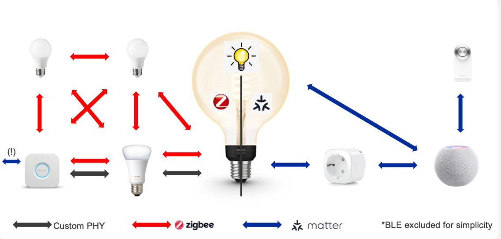

# Matter over Thread Zigbee Lighting Example

Example using Matter alongside Zigbee on Silicon Labs MG24/MG26. The light can be controlled by a Zigbee switch or a Matter controller.

## Table of Contents

- [Purpose/Scope](#purposescope)
- [Prerequisites/Setup Requirements](#prerequisitessetup-requirements)
- [Steps to Run Demo](#steps-to-run-demo)
- [Extending Base App Implementation](#extending-base-app-implementation)
- [Troubleshooting](#troubleshooting)
- [Resources](#resources)
- [Report Bugs & Get Support](#report-bugs--get-support)

## Purpose/Scope

This example demonstrates Matter and Silicon Labs Zigbee running together on EFR32 (MG24/MG26). The lighting device can receive On/Off commands from both a Zigbee switch (e.g. [Z3 switch](https://www.silabs.com/support/training/Zigbee-application-layer-concepts/building-a-Zigbee-3-0-switch-and-light-from-scratch) sample app) and a Matter controller (Google, Apple, chip-tool). The device is commissioned over BLE, credentials are then provided so it joins the Thread network.



## Prerequisites/Setup Requirements

### HW Requirements

For a full list of hardware requirements, see [Matter Hardware Requirements](https://docs.silabs.com/matter/2.8.1/matter-overview/#hardware-requirements) documentation.

### SW Requirements

For a full list of software requirements, see [Matter Software Requirements](https://docs.silabs.com/matter/2.8.1/matter-overview/#software-requirements) documentation. The following prerequisites must be installed on the host: ARM GCC 12.2, ZAP (version 2024.05.07 or greatest), SLC-CLI, environment variables set (e.g. ARM_GCC_DIR, TOOLDIR, STUDIO_ADAPTER_PACK_PATH).

## Steps to Run Demo

### Program a Bootloader

If building a solution, the bootloader is included and flashed as part of the combined artifact.

If building the sample application on its own, a bootloader must be flashed separately before the application. Pre-built bootloader binaries for all supported devices are available at [Matter Bootloader Binaries](https://docs.silabs.com/matter/2.8.1/matter-prerequisites/matter-artifacts#matter-bootloader-binaries).

### Configuration and Setup

**Build variant**

This sample app supports two build variants: Sequential Zigbee & Matter and Concurrent Zigbee & Matter.

- **Sequential Zigbee & Matter:** In this scenario the node will act as a plain Zigbee device with the full set of Zigbee feature working properly such as Touchlink.
- **Concurrent Zigbee & Matter:** In this scenario the node will act both as a Zigbee device and a Matter device capable of receiving commands from both protocol at the same time.

**Known limitations**

- CLI & Logs output are defaulted to the uart interface. Instead of having logs on RTTViewer and CLI/ Matter shell on the UART, everything is forwarded to the uart to prevent weird routing of log messages and uart commands. Issue is present with SISDK 2024.6.0
- Single Channel listening: Probably the biggest limitation for this examples in concurrent mode. With SISDK 2024.6.0 the radio mux only support a single channel for listening. This mean that when the device is commissioned on the Matter network it needs to switch channel to match the one used by the OTBR. Since the OTBR can be a fully closed product like a Google Nest Hub, an Apple TV, an Amazon echo etc... there is absolutely no control over which channel is going to be selected. As such other steering channel feature like Touchlink are incompatible with this sample app because of this limitation in concurrent mode.

**Expected behaviour**

Once the application is build and flashed onto the device, you should see the Matter QR code displayed and if you're using a BLE sniffer like the EFRConnect app you should be able to see the Silabs-Light being advertised and ready to be commissioned into a Matter network.

- **Sequential Zigbee & Matter:** With this build variant your device will act as a Zigbee device as long as no Matter fabric are present on the device. Once the device is successfully commissioned with Matter the Zigbee network will be shutdown forever (or until the next factory reset). Features like touchlink will work just fine with this build variant since there is no need to listen on multiple channel at once.
- **Concurrent Zigbee & Matter:** With this build variant, the light can be controlled simultaneously from the Matter side or the Zigbee side. For the best user experience, it is advised to commission the Matter side **FIRST** as the OTBR will trigger a channel switch on the Zigbee side. Should Zigbee be commissioned first, then upon completion of the Matter commissionning process a network leave followed by a network start will be issued to the Zigbee stack in order to achieve a successful channel switch without missing any packets from the Matter side. As such all previously paired device on the Zigbee side will have to be re-paired with the device. Again this is a limitation caused by SiSDK 2024.6.0. This should be fixed with in the future versions of SiSDK.

**Building command** (from repo root):
```shell
./slc/build.sh slc/apps/zigbee_light/thread/matter_thread_soc_zigbee_light.slcp brd4187c,matter_zigbee_sequential
./slc/build.sh slc/apps/zigbee_light/thread/matter_thread_soc_zigbee_light.slcp brd4187c,matter_zigbee_concurrent
```
Building it without any extra component will default to the concurrent version:
```shell
./slc/build.sh slc/apps/zigbee_light/thread/matter_thread_soc_zigbee_light.slcp brd4187c
```

**Customizing**

This sample app can be customized to fit most of your need. Here is how:

- **Matter:** Just like any other Matter sample app you can add and remove the Matter extension components that you need.
- **Zigbee:** Just like any other Zigbee sample app you can add and remove the Matter extension components that you need. However if you want to support install code, you need to actually modify the configuration file present within this project to set `SL_MATTER_CMP_SECURE_ZIGBEE` to 1. This will disable TouchLink and use the provided install code and EUID64 present in the same configuration file (`sl_cmp_config.h`)
- **DataModel:** Since Matter and Zigbee data model are quite similar this project only needs a single zap file for both protocol. For the best user experience it is recommended that the endpoint configuration match as close as possible on the two protocols (except for endpoint 0 which is protocol specific)

For Matter customization see also [Custom Matter Device Development](https://docs.silabs.com/matter/2.8.1/matter-references/custom-matter-device#custom-matter-device-development).

### Steps for Execution

1. Build and flash the bootloader and application to your board using the desired build variant (see Configuration and Setup for build commands).
2. On startup, the Matter QR code is displayed and the device advertises (e.g. as Silabs-Light) for Matter commissioning.
3. Commission the device over Thread (e.g. `chip-tool pairing ble-thread 1 hex:<operationalDataset> 20202021 3840`). For concurrent mode, commissioning Matter first is recommended.
4. Control the light from a Matter controller (e.g. `chip-tool onoff on 1 1`) or from a Zigbee switch (pair the switch with the light).

**Button and LED reference:**

Button and LED behavior depends on the project configuration, refer to the lighting and Zigbee components for application-specific mappings. LED 0 typically indicates commissioning/connectivity when WSTK LED Support is installed.

## Extending Base App Implementation

### CustomerAppTask

To implement custom app behavior you can override any Silicon Labs implemented API in the CustomerAppTask file. This example provides `CustomerAppTask.h` and `CustomerAppTask.cpp` for that purpose. The base implementation and the full set of overridable `*Impl()` APIs are supplied by the build system in `AppTask.cpp` and `AppTaskImpl.h` under `autogen/`. Any `*Impl()` you do not override keeps the Silicon Labs default behavior.

### How to Override APIs

`CustomerAppTask` extends the base AppTask through the Curiously Recurring Template Pattern (CRTP). You override only the `*Impl()` methods you need, the base declares one `*Impl()` per overridable API. Steps:

1. Find the method to override in the base API (see [Override API reference](#override-api-reference) below).
2. Declare the same method signature in `CustomerAppTask` in your `CustomerAppTask.h` under `private:`. Match the base *Impl() signature exactly — note that *Impl() overrides are non-static instance methods even when the public dispatcher (e.g. ButtonEventHandler) is static.
3. Implement the method in `CustomerAppTask.cpp`.
4. Build the project. Each overridable API is resolved as follows: **if you implemented that `*Impl()` in CustomerAppTask, your implementation is used, otherwise the Silicon Labs default implementation is used.** You only implement what you need, everything else falls back to the default automatically.

### DataModelCallbacks and CustomerAppTask

What used to live in `DataModelCallbacks.cpp` now lives in `AppTask.cpp`. The
Matter SDK's `MatterPostAttributeChangeCallback` is implemented in
`examples/platform/silabs/BaseApplication.cpp` and forwards to
`AppTask::DMPostAttributeChangeCallback` (defined in `AppTask.cpp`), which you
can customize via `DMPostAttributeChangeCallbackImpl()` in `CustomerAppTask`.

Forwarding into `AppTask` still goes through CRTP as in
[How to Override APIs](#how-to-override-apis).

-   **Methods that already exist in the AppTask** — Customize them by overriding
    the matching `*Impl()` method in `CustomerAppTask`. Do not edit the
    `AppTask.cpp` for app-specific behavior.

-   **New custom data model methods** — Add them in `CustomerAppTask` directly.
    Do not add new application logic in autogenerated sources; those edits will
    not survive regeneration or project upgrades.

### Sample Implementation

The following shows a minimal example `CustomerAppTask` that overrides `AppInitImpl()` and `ButtonEventHandlerImpl()`.

**CustomerAppTask.h**

```cpp
#pragma once
#include "AppTaskImpl.h"

/**
 * Minimal AppTaskImpl-derived class. Override only the *Impl() methods you need;
 * add AppInitImpl(), GetAppTask(), and sAppTask as required by the CRTP base.
 */
class CustomerAppTask : public AppTaskImpl<CustomerAppTask>
{
public:
    static CustomerAppTask & GetAppTask() { return sAppTask; }

private:
    friend class AppTaskImpl<CustomerAppTask>;
    CHIP_ERROR AppInitImpl();
    void ButtonEventHandlerImpl(uint8_t button, uint8_t btnAction);
    static CustomerAppTask sAppTask;
};
```

**CustomerAppTask.cpp**

```cpp
#include "CustomerAppTask.h"
#include "AppTask.h"
#include "AppConfig.h"
#include "AppEvent.h"
#include <platform/CHIPDeviceLayer.h>
#include <platform/silabs/platformAbstraction/SilabsPlatform.h>

using namespace ::chip::DeviceLayer::Silabs;

#define APP_FUNCTION_BUTTON 0
#define APP_LIGHT_SWITCH     1

CustomerAppTask CustomerAppTask::sAppTask;

AppTask & AppTask::GetAppTask()
{
    return CustomerAppTask::GetAppTask();
}

CHIP_ERROR CustomerAppTask::AppInitImpl()
{
    SILABS_LOG("CustomerAppTask: custom implementation (AppInitImpl)");
    CHIP_ERROR err = this->AppTask::AppInit();
    if (err == CHIP_NO_ERROR)
    {
        // Override the SDK default button handler registered in AppTask::AppInit().
        chip::DeviceLayer::Silabs::GetPlatform().SetButtonsCb(CustomerAppTask::ButtonEventHandler);
    }
    return err;
}

void CustomerAppTask::ButtonEventHandlerImpl(uint8_t button, uint8_t btnAction)
{
    SILABS_LOG("CustomerAppTask: custom implementation (ButtonEventHandlerImpl)");
    AppEvent button_event           = {};
    button_event.Type               = AppEvent::kEventType_Button;
    button_event.ButtonEvent.Action = btnAction;
    if (button == APP_LIGHT_SWITCH && btnAction == static_cast<uint8_t>(SilabsPlatform::ButtonAction::ButtonPressed))
    {
        button_event.Handler = LightActionEventHandler;
        AppTask::GetAppTask().PostEvent(&button_event);
    }
    else if (button == APP_FUNCTION_BUTTON)
    {
        button_event.Handler = BaseApplication::ButtonHandler;
        AppTask::GetAppTask().PostEvent(&button_event);
    }
}
```

## Troubleshooting

**Commissioning fails**
- Ensure the Thread Border Router is running and the `operationalDataset` matches your network.
- In concurrent mode, if Zigbee was commissioned first, Matter commissioning may trigger a Zigbee network leave/restart, re-pair Zigbee devices afterward.

**Zigbee or Matter control not working**
- In concurrent mode, ensure Matter was commissioned first to avoid channel conflicts.
- Verify both stacks are built and the correct variant (sequential vs concurrent) is flashed.

**LCD or LEDs not working**
- **LCD:** If the board supports an LCD but it is not enabled, install the _Display_ component under _Silicon Labs Matter > Matter > Platform > Display_. For the QR code on the LCD, install the _QR Code_ component under _Silicon Labs Matter > Matter > Platform > QR Code_ (Display is installed automatically).
- **LEDs:** If the board supports LEDs but they are not enabled, install `led0` and `led1` instances of _Simple LED_ under _Platform > Driver > LED > Simple LED_, then install _WSTK LED Support_ under _Silicon Labs Matter > Matter > Platform > WSTK LED Support_.

## Resources

- [Silicon Labs Matter over Thread Documentation](https://docs.silabs.com/matter/2.8.1/matter-thread)
- [Matter Hub Setup](https://docs.silabs.com/matter/2.8.1/matter-thread/raspi-img)
- [chip-tool README](https://github.com/project-chip/connectedhomeip/blob/master/examples/chip-tool/README.md)

## Report Bugs & Get Support

You are always encouraged and welcome to report any issues you found to us via [Silicon Labs Community](https://community.silabs.com).
